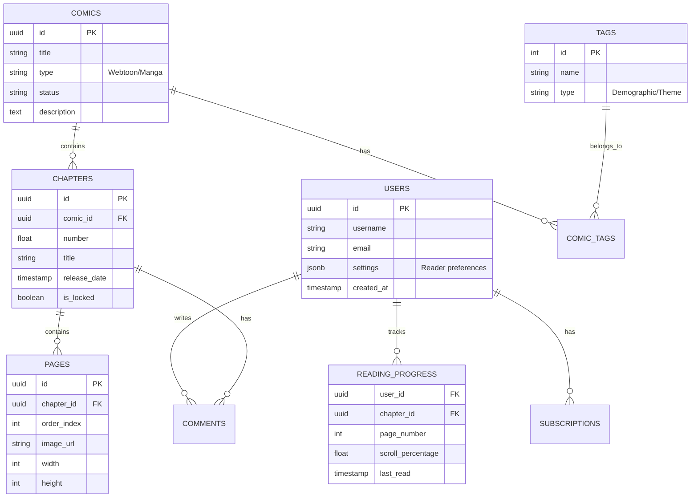

# OmniRead - Technical Specification

## 1. Technology Stack

### 1.1 Frontend
*   **Mobile (iOS/Android):** Flutter
    *   **Reasoning:** Skia graphics engine provides high-performance rendering essential for the "Hybrid" reader (gapless stitching, smart split). Single codebase for both platforms.
*   **Web:** Next.js (React)
    *   **Reasoning:** Server-Side Rendering (SSR) is critical for SEO (indexing comic pages/chapters).

### 1.2 Backend
*   **Language:** Go (Golang)
    *   **Reasoning:** High concurrency support (Goroutines) is ideal for handling thousands of simultaneous connections for "Danmu" and real-time sync. Microservices architecture.

### 1.3 Database & Search
*   **User Data & Billing:** PostgreSQL
    *   **Reasoning:** ACID compliance is required for transactional data (subscriptions, coin purchases).
*   **Comments & Danmu:** MongoDB
    *   **Reasoning:** Flexible schema for nested comments and high write throughput for bullet comments.
*   **Search Engine:** Meilisearch
    *   **Reasoning:** Optimized for typo-tolerance and fast faceted search, perfect for the complex Boolean tag system.

## 2. Architecture Overview
*   **Microservices:**
    *   `auth-service`: User authentication, OAuth (MAL/AniList).
    *   `content-service`: Comic metadata, chapter management.
    *   `reader-service`: Image delivery, polymorphic rendering logic.
    *   `social-service`: Comments, Danmu, Community threads.
    *   `sync-service`: 2-way sync with external platforms.
    *   `billing-service`: Subscriptions, "Wait-to-Read" logic.

## 3. Database Schema



## 4. API Endpoint Structure

### 4.1 Reader API
*   `GET /api/v1/comics/{comic_id}`: Get comic metadata.
*   `GET /api/v1/chapters/{chapter_id}`: Get chapter details (images, previous/next links).
    *   **Response:**
        ```json
        {
          "id": "uuid",
          "pages": [
            { "url": "...", "width": 1080, "height": 1920 },
            { "url": "...", "width": 1080, "height": 1920 }
          ],
          "mode": "webtoon" // Auto-detected
        }
        ```

### 4.2 Library Sync API
*   `POST /api/v1/sync/external`: Trigger manual sync to external services.
    *   **Body:** `{ "services": ["mal", "anilist"] }`
*   `POST /api/v1/sync/progress`: Update reading progress (called on page turn/scroll end).
    *   **Body:**
        ```json
        {
          "chapter_id": "uuid",
          "progress": 100,
          "status": "reading"
        }
        ```
    *   **Behavior:** Asynchronously updates local DB and queues jobs for external sync.

## 5. Accessibility & AI
*   **Alt-Text Generation:** Background worker listens for new image uploads, sends to Vision API (e.g., GPT-4o Vision or open-source alternative), and stores description in `PAGES` table.
